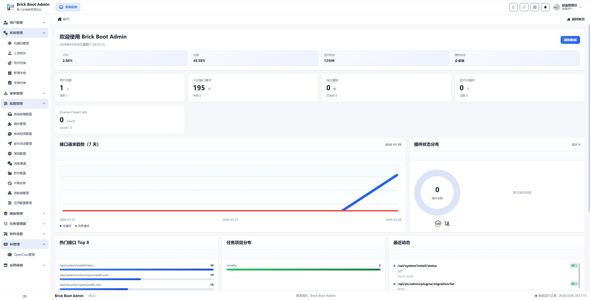
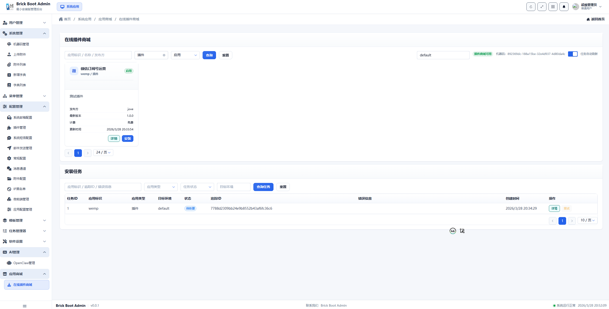
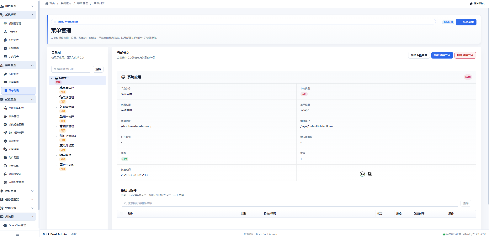

# Brick Boot Admin 在线演示

## 访问信息

| 项目 | 内容 |
| --- | --- |
| 演示地址 | https://hzj888-brick-bootkit-admin.ms.show/ |
| 登录账号 | admin |
| 登录密码 | 123456789 |

> 演示环境仅供功能体验与评估使用，数据会定期重置，请勿存放重要信息。

---

## 功能预览

### 1. 系统首页 — 数据总览

首页为系统的综合仪表盘，登录后默认展示，涵盖以下信息：

- **系统运行指标**：实时显示 CPU 使用率、内存占用、磁盘用量等服务器状态
- **业务统计卡片**：用户总数、今日接口请求数、插件数量、已安装扩展数等关键指标一目了然
- **License Cloud Calls**：授权云调用次数统计
- **接口流量趋势（7 天）**：以折线图展示近 7 天的接口成功/失败请求趋势，便于观察系统负载变化
- **插件状态分布**：以环形图展示当前插件的运行状态分布
- **热门接口 Top 8**：按调用量排序展示最活跃的 API 接口
- **任务项目分布**：安装任务按项目维度的分布情况
- **最近动态**：展示系统最近的操作事件与接口调用记录

---

### 2. 在线插件商城

插件商城是平台可扩展生态能力的核心入口，支持以下操作：

- **插件浏览与搜索**：按应用名称、应用 ID、插件类型等条件筛选，快速定位目标插件
- **插件详情查看**：展示插件的开发者、最新版本、类型、更新时间等基本信息，支持详情与安装操作
- **安装任务管理**：下方集成安装任务列表，可查看每个插件的安装状态（安装中、已完成、失败等）、目标环境、创建时间，并支持详情查看与重试
- **多环境支持**：支持选择不同的目标环境进行安装部署

---

### 3. 菜单管理

菜单管理提供对系统菜单树的完整可视化配置能力：

- **菜单树结构**：左侧以树形结构展示所有菜单节点，支持搜索与折叠展开，层级关系清晰
- **节点详情编辑**：选中任意菜单节点后，右侧展示该节点的完整配置信息，包括：
  - 节点名称与类型（应用 / 菜单 / 按钮）
  - 所属模块与模块标识
  - 路由路径与布局路径
  - 打开方式与微前端模块 ID
  - 排序与状态控制
- **按钮与操作权限**：底部区域支持管理当前菜单节点下挂载的按钮和操作权限，实现菜单级别的细粒度权限控制
- **新增与批量操作**：支持新增子菜单、编辑当前节点、删除当前节点等操作

---

## 更多功能模块

演示环境中还包含以下功能模块，可登录后逐一体验：

| 模块 | 说明 |
| --- | --- |
| 用户管理 | 用户账号的创建、编辑、禁用与角色分配 |
| 机构管理 | 组织与部门结构的层级管理 |
| 角色管理 | 角色的定义与菜单权限分配 |
| 上传管理 | 文件上传与存储资源管理 |
| 数据列表 | 通用数据查看与管理 |
| 系统监控 | 系统运行状态、性能指标与健康检查 |
| 日志管理 | 操作日志与系统日志的查询与追溯 |
| 软件设置 | 系统基础参数与全局配置 |
| 任务管理 | 安装任务与异步任务的状态跟踪与管理 |
| AI 管理 | AI / MCP 服务接入与管理 |
| 应用商城 | 在线插件商城与扩展应用管理 |

---

## 演示环境说明

- 演示环境为公共体验环境，所有用户共享同一账号
- 部分敏感操作（如删除核心数据、修改系统配置）可能受到权限限制
- 如需完整功能评估或私有化部署体验，请参阅 [授权与套餐说明](../README.md#授权与套餐说明)

